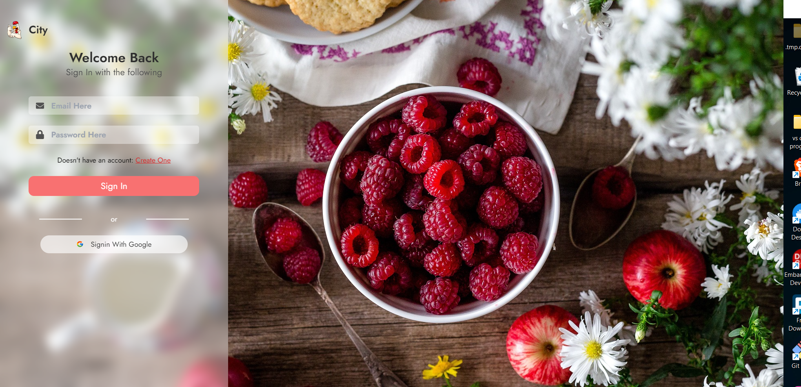

> Fullstack Food Delivery Application using Reactjs
> This application is a simple Food Delivery application for the Learning purposes



# To check the node version

```
node --version
```

# To inittialize the Firebase console

```
firebase init
```

# To start the server

```
npm run serve
```

# To create react project using npm & yarn

```
npm create-react-app folder_name
```

```
yarn create react-app folder_name
```

# To start the client

```
yarn start
```
